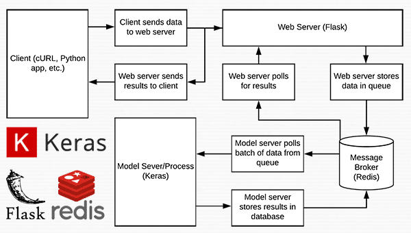

## Credits: 

1) https://www.pyimagesearch.com/2018/02/05/deep-learning-production-keras-redis-flask-apache/
2) https://medium.com/analytics-vidhya/deploy-machine-learning-models-with-keras-fastapi-redis-and-docker-4940df614ece
3) https://shivamrana.me/2020/05/flask-prod/
4) https://gabimelo.medium.com/developing-a-flask-api-in-a-docker-container-with-uwsgi-and-nginx-e089e43ed90e

## boiler plates with following configs for flask based web server with redis used as message broker in backend and simple python based model server

    1.) Flask dev server
    2.) uwsgi based prod server (the fastest wsgi framework in python) with nginx as web server
    3.) Fastapi based prod serevr (the mainstream asgi framework) with Gunicorn  

## run_web_server.py contains all our Flask web server code — nginx will load this when starting our deep learning web app.
## run_model_server.py will:
    a.)  Load our Keras model from disk
    b.)  Continually poll Redis for new images to classify
    c.)  Classify images (batch processing them for efficiency)
    d.)  Write the inference results back to Redis so they can be returned to the client via Flask
## settings.py contains all Python-based settings for our deep learning productions service, such as Redis host/port information, image classification settings, image queue name, etc.
## helpers.py contains utility functions that both run_web_server.py and run_model_server.py will use (namely base64 encoding).
## keras_rest_api_app.wsgi contains our WSGI settings so we can serve the Flask app from our Apache server.
## simple_request.py can be used to programmatically consume the results of our deep learning API service.
## jemma.png is a photo of my family’s beagle. We’ll be using her as an example image when calling the REST API to validate it is indeed working.
## Finally, we’ll use stress_test.py to stress our server and measure image classification throughout.
## Building our deep learning web app
